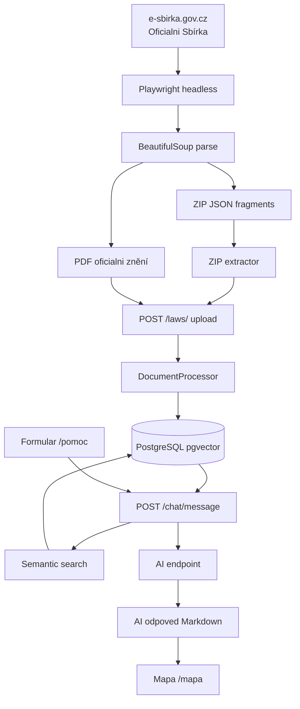
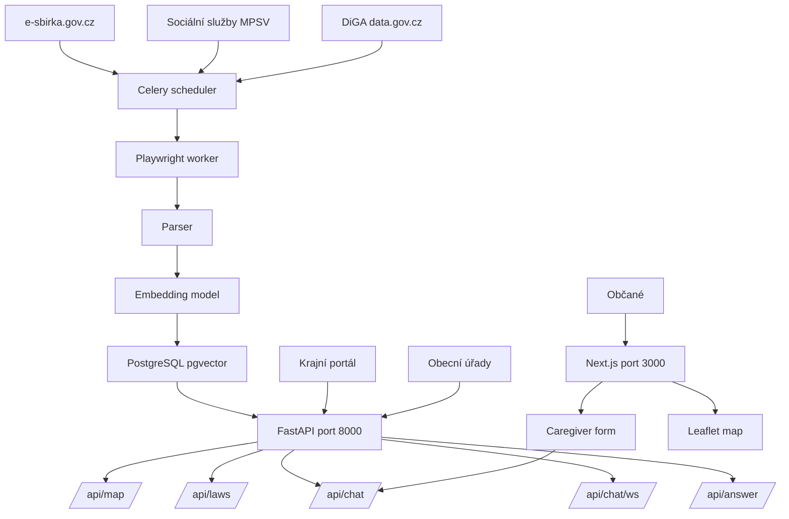

# Právní analýza využití dat z e-sbírky.gov.cz pro RAG systém

**Datum:** 2026-06-30  
**Autor:** Datové centrum Ústeckého kraje  
**Status:** Koncept  

---

## 1. Shrnutí

Datová infrastruktura projektu **What Now?** (Co teď?) je právně **plně způsobilá** pro provoz v Datovém centru Ústeckého kraje. Zdrojová data ze Sbírky zákonů ČR jsou **svobodná úřední díla** bez autorskoprávní ochrany. Nejsou vyžadována žádná licenční ujednání, poplatky ani souhlasy.

---

## 2. Právní status dat ze Sbírky zákonů

### 2.1 Autorský zákon č. 121/2000 Sb.

Podle **§ 3 odst. 1 písm. a)** autorského zákona se ochrana nevztahuje na:

> **„úřední dílo, jímž je právní předpis, rozhodnutí, opatření obecné povahy, veřejná listina, veřejně přístupný rejstřík a sbírka jeho listin, jakož i úřední návrh úředního díla a jiná přípravná úřední dokumentace"**

Sbírka zákonů ČR (včetně e-sbírky.gov.cz) je tvořena výlučně úředními díly:

- **Zákony** (Parlament ČR)
- **Nařízení vlády** (Vláda ČR)
- **Vyhlášky** (ministerstva a další orgány)
- **Rozhodnutí** ústavních soudů, Nejvyššího soudu, Nejvyššího správního soudu

### 2.2 Důsledky

| Vlastnost | Stav |
|---|---|
| Autorskoprávní ochrana | ❌ Ne — úřední dílo (§ 3 odst. 1 AZ) |
| Databázové právo pořizovatele | ❌ Ne — neexistuje investice do získávání obsahu |
| Licenční ujednání | ❌ Není potřeba |
| Poplatky za použití | ❌ Ne |
| Omezení účelu užití | ❌ Žádná |
| Povinnost uvést zdroj | ⚠️ Doporučeno jako best practice |

### 2.3 Související předpisy

- **Zákon č. 106/1999 Sb.** (zákon o svobodném přístupu k informacím) — ukládá veřejným subjektům povinnost zpřístupňovat informace
- **Zákon č. 412/2005 Sb.** — přístup k dokumentům veřejné správy
- **Zákon č. 60/2026 Sb.** (Zákon o správě dat) — implementace EU Data Governance Act, podporuje sdílení dat veřejného sektoru

---

## 3. Zdroje dat a formáty

### 3.1 E-sbírka.gov.cz

Oficiální elektronická platforma Ministerstva vntra ČR pro Sbírku zákonů.

**URL:** `https://e-sbirka.gov.cz`

#### Formáty ke stažení:

| Formát | Popis | Struktura |
|---|---|---|
| **JSON (ZIP)** | Strukturovaná data fragmentů | `metadata` + `fragmenty[]` |
| **PDF** | Oficiální tištěná podoba | Textové chunky |

#### Struktura JSON výstupu:

```json
{
  "metadata": {
    "predpisCislo": "89/2012 Sb.",
    "rocnik": 2012
  },
  "fragmenty": [
    {
      "fragmentId": 1075645819,
      "xhtml": "<p>...</p>",
      "typ": "Odstavec_Dc",
      "hloubka": 2
    }
  ]
}
```

#### Metadata z PDF:

- Extrahováno z názvu: `Sb_2006_108_...pdf` → `108/2006 Sb.`
- Regex z textu: `(\d+/\d{4}\s+Sb\.)`
- Formát citace: `Zákon č. 108/2006 Sb., ve znění pozdějších předpisů`

### 3.2 Sociální služby (poskytovatele)

Zdroj: **Rejstřík poskytovatelů sociálních služeb** (MPSV ČR)

- Formát: JSON + CSV adres
- Obsahuje: poskytovatelé, služby, lokace, cílové skupiny
- Embeddingy: `servicetargetgroup.description` → `VECTOR(768)`

### 3.3 Další potenciální zdroje

| Zdroj | URL | Status |
|---|---|---|
| Zákony pro lidi (AION CS) | `zakonyprolidi.cz` | 🔴 **Komerciální** — licence nutná |
| Portál otevřených dat | `data.gov.cz` | 🟢 Otevřená data — CC BY 4.0 |
| Veřejný datový fond | `rdf.gov.cz` | 🟢 Státní dokumenty |

> **Pozor:** `zakonyprolidi.cz` je **komerční platforma** (AION CS, s.r.) s vlastní licencí. Její obsah (komentáře, AI asistent ALEX, agregované funkce) chráněn autorským právem. Pouze originální texty zákonů (úřední dílo) jsou svobodné.

---

## 4. Architektura RAG systému



---

## 5. Datový tok pro provoz v DC Ústeckého kraje



---

## 6. Právní požadavky pro provoz

### 6.1 Co lze bez omezení

✅ Rozmnožovat a indexovat texty zákonů  
✅ Vytvářet embedding vektory (transformace textu → čísla)  
✅ Provozovat semantický search (pgvector cosine similarity)  
✅ Generovat AI odpovědi na základě citací zákonů  
✅ Poskytovat přístup občanům a úřadům  
✅ Komercializovat nadstavbové služby (chat, mapa)  

### 6.2 Co je třeba respektovat

⚠️ **Aktualizace znění:** Zákony se novelyzují. Je třeba sledovat `aktualne-vyhlasene-predpisy` na e-sbirka.gov.cz a průběžně aktualizovat databázi.

⚠️ **Komentáře a analýzy:** Texty z komerčních zdrojů (např. `zakonyprolidi.cz`) obsahují autorská díla třetích stran (komentáře, analýzy, metadata). Pouze čistý text předpisu je svobodný.

⚠️ **Ochrana osobních údajů:** Pokud by RAG systém náhodně vrátil osobní údaje z judikatury, je třeba postupovat podle GDPR a zákona č. 110/2019 Sb.

⚠️ **Sociální služby:** Data z rejstříku MPSV jsou veřejná, ale mohou obsahovat osobní údaje kontaktních osob. Je třeba ověřit status podle zákona č. 110/2019 Sb. o zpracování osobních údajů.

### 6.3 Doporučené licenční uveřejnění

Pro transparentnost doporučujeme uvést v aplikaci:

> *"Právní informace vycházejí ze Sbírky zákonů České republiky dostupné na e-sbirka.gov.cz. Texty zákonů jsou úředními díly podle § 3 odst. 1 písm. a) zákona č. 121/2000 Sb. (autorský zákon) a nejsou předmětem autorskoprávní ochrany."*

---

## 7. Technická doporučení

### 7.1 Ingest pipeline

```
Sběr (denně/nově) → Parsing → Chunking → Embedding → Uložení → Index
```

- **Scheduler:** Celery Beat (zakomentováno v docker-compose)
- **Parsování:** Playwright → BeautifulSoup (pro e-sbirka.gov.cz)
- **Chunking:** Přes fragmenty z JSON nebo PDF text chunks (max 2000 zn.)
- **Embedding:** SentenceTransformer `paraphrase-multilingual-mpnet-base-v2`
- **Uložení:** PostgreSQL + pgvector (`VECTOR(768)`)
- **Filter:** `source_kind` → `fragment` (JSON) nebo `pdf`

### 7.2 Frekvence aktualizace

| Zdroj | Frekvence | Mechanismus |
|---|---|---|
| Sbírka zákonů | Denně | Celery worker → e-sbirka.gov.cz rejstřík |
| Sociální služby | Týdně | CSV/JSON import |
| Judikatury | Příležitostně | Ruční upload |

### 7.3 Monitoring

- Kontrola `document_number` a `year` při ingestu (unikátnost)
- Logování nově nalezených novelizací
- Alerting při chybě Playwright scrape

---

## 8. Shrnutí rozhodnutí

| Otázka | Odpověď |
|---|---|
| Lze použít data ze Sbírky zákonů? | **Ano** — svobodná úřední díla (§ 3 AZ) |
| Lze vytvářet embedding vektory? | **Ano** — technická transformace, ne autorské dílo |
| Lze provozovat RAG/LLM search? | **Ano** — bez licenčních omezení |
| Lze poskytovat AI odpovědi? | **Ano** — citace úředních textů |
| Lze provozovat v DC Ústeckého kraje? | **Ano** — veřejný sektor, veřejná služba |
| Je nutná licenční smlouva? | **Ne** |
| Je nutná platba? | **Ne** |
| Jak citovat zdroje? | `Zákon č. XXX/YYY Sb.` — standardní forma |
| Pozor na komerční agregátory? | **Ano** — zakonyprolidi.cz je komerční produkt |

---

## 9. Reference

| Předpis | Částka | Uplatnění |
|---|---|---|
| Zákon č. 121/2000 Sb. (autorský zákon), § 3 odst. 1 | 36/2000 | Úřední dílo = bez autorskoprávní ochrany |
| Zákon č. 106/1999 Sb. | 39/1999 | Povinnost poskytovat informace |
| Zákon č. 412/2005 Sb. | — | Přístup k dokumentům veřejné správy |
| Zákon č. 60/2026 Sb. | — | Správa dat, Data Governance Act |
| Nařízení (EU) 2019/1024 | — | Otevřená data a opakované užití |

---

*Poznámka: Tento dokument má informativní charakter a nenahrazuje právní poradenství. Pro závazný právní posudek doporučujeme konzultaci s právním oddělením Ústeckého kraje.*
